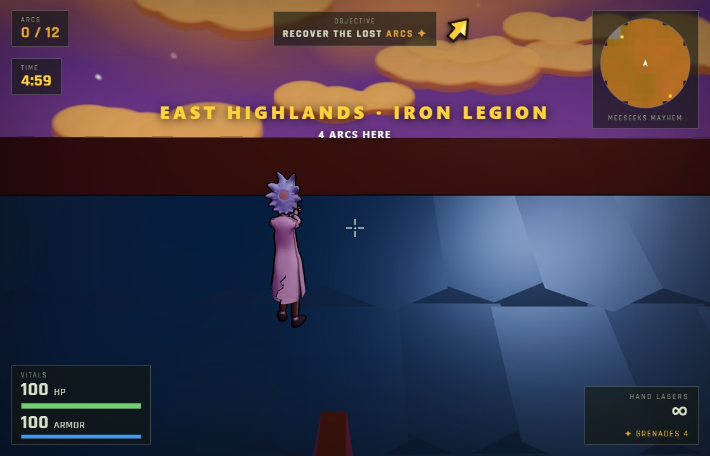

# 🧞 GENIE

**GENIE** — a **G**enerative **E**ngine for **N**ative **I**nteractive **E**xperiences.
*Make a wish, ship a game.*

A small, hackable game engine for the browser — built on **Three.js** (r0.169) and **Vite**, no
framework, no build magic. It ships three complete, polished games (first- **and** third-person) and a
clean, **AI-first** toolkit of *skills* so you — and your AI pair — can conjure your **own** web game on
top of it fast.

> **A themed kit, not a blank engine — with honest reuse tiers.** `engine/` is generic, view-agnostic
> game infrastructure (first- or third-person); `kit/` is a batteries-included *world toolkit* built on
> it (it knows about walls, towers, vehicles, islands on purpose); `game/` is a shipped game. Reuse just
> the engine, the whole kit, or fork a game — see [Architecture](#architecture-at-a-glance).

## Three games, one engine

**▶ [Play MEESEEKS MAYHEM](https://genie-web-game-engine.up.railway.app/?level=meeseeks_mayhem)** — a *third-person* Rick & Morty romp: you're **Rick**, time is broken (again), and you must recover the **12 white magic rings** while fending off a rain of Mr. Meeseeks — regular, huge, and rare **kaiju-sized giants**. Start with infinite **green hand-lasers**, scavenge real blasters, jet around with **Iron-Man boots + palms**, and poof the blue idiots.

| | |
|:-:|:-:|
|  |  |

**▶ [Play ARCFALL](https://genie-web-game-engine.up.railway.app/?level=arcfall)** — a *first-person* daytime island survival hunt: drop onto a time-fractured island, recover the **12 lost Arcs**, and survive the dinosaurs and giant mechs that guard them.

| | |
|:-:|:-:|
|  |  |

**▶ [Play NightOps](https://genie-web-game-engine.up.railway.app/?level=desert-base)** — a *first-person* night military raid: infiltrate the desert base and **reach & disarm the bomb** before detonation.

| | |
|:-:|:-:|
|  |  |

> All three ship on the same engine + kit — proof it generalizes across views, genres and art styles
> (reuse just `engine/`, the whole `kit/`, or fork a `game/`).

---

## What's in the box

- **First- AND third-person controller** — pointer-lock look, WASD, sprint, jump (with animation), duck,
  headbob; an orbit-cam third-person mode with a visible, skeletally-animated avatar.
- **Character animation** — an upper/lower-body split rig (run-and-gun: legs stride while arms aim),
  procedural aim, jet/thruster states, and drop-in Mixamo clips (idle/walk/run/gunplay/jump/dance).
- **Gunplay & energy weapons** — hitscan guns (recoil, tracers, sparks/decals, hitmarkers), sci-fi
  **energy beams** with a single-source color (beam + core + flashes + impact all match), a **missile
  launcher**, **grenades**, and pickup-to-acquire weapon scavenging.
- **VFX** — laser bolts, colored ground **force-field** bursts (with AoE), explosions, shockwaves,
  size-scaled death poofs (dust + smoke), GPU particle thrusters.
- **Engine impact system** — distance-falloff blasts that damage enemies, knock back/ragdoll, and shove
  mass-aware physics props; destructible barrels/tanks/vehicles with chain-reaction cook-offs.
- **Rigged glTF enemies** — patrol → take-cover → peek-and-fire AI, plus ranged **Meeseeks** (gun/rocket),
  size tiers (normal / huge / giant), and an enemy **gunship boss**.
- **Levels as data** — drop a module in `src/game/levels/`, register it, and it's selectable with
  `?level=<id>`. Ships `meeseeks_mayhem`, `arcfall`, `compound`, `desert-base`.
- **Story & audio** — per-level music (synth + real tracks), voice lines, intro/victory crawls, and a
  deploy screen (with dancing Rick + flamenco on the Meeseeks level).

## Controls (desktop)

- **WASD** move · **Shift** sprint · **Space** jump · **C** duck · **E** jetpack/boots
- **Mouse** look · **Left-click** fire · **R** reload · **Q** cycle weapon
- **Right-click** throw a grenade · Click **Deploy** to lock the mouse and start.

> **Desktop / laptop only for now.** Phones/tablets get a "play on a computer" gate (`src/device.js`);
> touch controls exist in `engine/touch.js` but are disabled. Input is read by **physical key**
> (`event.code`), so non-Latin layouts (Hebrew, Russian, …) work without switching to English.

## Run it

```bash
npm install
npm run dev        # http://localhost:5180
```

Pick a game with a query param: `http://localhost:5180/?level=meeseeks_mayhem`

## Build & deploy

```bash
npm run build      # -> dist/
npm start          # serves dist/ on $PORT (default 8080) via server.js
```

Deploys as a static site behind a tiny Node server (`server.js`). The live demo runs on Railway.

## Architecture at a glance

Three tiers, flat and framework-free. The arrows show what may import what — a lint rule
(`npm run lint`) enforces it, so the layers can't rot into each other:

```
engine/  ← generic, content-agnostic, view-agnostic game systems
   ▲       render • first/third-person controller • input • weapon viewmodel • projectiles+blast • vfx • hud • audio • assets
   │
kit/     ← the WORLD TOOLKIT (uses engine, never game)
   ▲       level-builder (walls/towers/vehicles/island…) • destructibles • content/ (model catalogs)
   │
game/    ← ONE game (uses engine + kit)
           config+balance • combat • actors/ (rick, meeseeks, enemy, helicopter) • objectives/ • levels/

main.js  ← the runner: wires the tiers, owns the state machine + per-frame loop
```

**The rule:** `engine/` imports nothing from `kit/` or `game/`; `kit/` may use `engine/`; `game/` may use
both. That's the reuse promise — take just `engine/`, or the whole `kit/`.

- **Tuning is data** — gameplay numbers live in `game/config.js` → `balance`; levels override per-section.
- **Content is data** — a level is a module `{ id, name, config?, build(b) }`; objectives and weapons are
  small modules behind a registry. Adding them doesn't touch the runner.

## Build your own (with your AI pair)

GENIE is **AI-first**: the [`skills/`](skills/) directory is a library of task recipes your agent runs to
extend the engine — add a level, weapon, enemy, or audio; verify in-browser; ship. Start with
`engine-overview`.

**Recommended path:** clone → `npm run dev` → copy a level module → register it in `levels/index.js` → lay
out your map with `LevelBuilder` → retune `config.balance` → (optionally) add an objective/weapon module.
Then `npm run lint && npm run build`.

- **[skills/](skills/)** — the AI-first task skills (LevelBuilder cheat-sheet, add-a-thing, verify, ship).
- **[ARCHITECTURE.md](ARCHITECTURE.md)** — the full module map + the dependency rule.
- **[CONTRIBUTING.md](CONTRIBUTING.md)** — the boundary rule, where-things-go table, house style, CI.
- **[AGENTS.md](AGENTS.md)** — building with **Claude / an AI agent**? The conventions, the `window.__game`
  dev hooks, and the in-browser verification workflow.

## Tech

Three.js (PointerLock/orbit cameras, GLTFLoader, SkeletonUtils, AnimationMixer, OutlineEffect),
procedural geometry & canvas textures, Web Audio (synth + decoded tracks). Single-page; no backend.

## Credits

- **Rick Sanchez:** UE4-rigged fan model, re-textured + Mixamo-animated (idle/walk/run/gunplay/jump/salsa).
- **Player operator (SWAT):** CC0 "Ultimate Modular Men" pack. **Vehicles:** Kenney CC0 Car Kit.
- **Blasters / ammo:** CC0 low-poly weapon packs. **Helicopters:** procedural.
- **Music:** "Get Schwifty" / Pacific Rim / Alien Boy (level tracks); Spanish flamenco (lemonmusiclab).
- **Voice lines:** Rick "wubba lubba dub dub" + "Mr. Meeseeks"; CS radio callout.

## License

[MIT](LICENSE). Bundled third-party assets keep their own CC0/MIT terms (see Credits).
